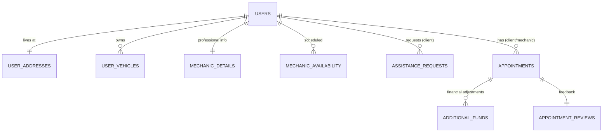

# Database Documentation 🗄️

This document outlines the SQLite database structure for the Mechanic application. The database is stored in `server/mechanic.db`.

## 🏗️ Schema Overview

The application uses a relational structure to manage users, their roles (User vs. Mechanic), vehicles, assistance requests, and appointments.

---

## 📋 Tables Reference

### 1. `users`
Core profile data for all accounts.
- **`id`** (TEXT, PK): Unique identifier (UUID).
- `email` (TEXT, UNIQUE): User's email address.
- `name` (TEXT): First name.
- `surname` (TEXT): Last name.
- `phone` (TEXT): Normalized phone number.
- `dob` (TEXT): Date of birth.
- `profileImage` (TEXT): Local path or URL to profile picture.
- `role` (TEXT): Either `'user'` or `'mechanic'`.

### 2. `user_addresses`
Physical address details linked to a user.
- **`userId`** (TEXT, PK, FK): Reference to `users.id`.
- `type` (TEXT): Address type (e.g., 'home', 'work').
- `street`, `apartment`, `city`, `state`, `zip` (TEXT): standard address fields.

### 3. `user_vehicles`
Vehicles registered by users.
- **`id`** (TEXT, PK): Unique identifier.
- `userId` (TEXT, FK): Reference to `users.id`.
- `make`, `model`, `color`, `plate`, `vin`, `details` (TEXT): Vehicle specifications.

### 4. `mechanic_details`
Professional information for users with the `'mechanic'` role.
- **`userId`** (TEXT, PK, FK): Reference to `users.id`.
- `workForDealer` (INTEGER): Boolean flag (0/1).
- `companyName` (TEXT): Current employer or shop name.
- `companyInvitation` (TEXT): Referral or invitation code.
- `expertiseDetails` (TEXT): Description of skills.
- `yearsExperience` (TEXT): Experience level.
- `aseMembership` (TEXT): ASE certification details.

### 5. `mechanic_availability`
Weekly working hours for mechanics.
- **`id`** (INTEGER, PK, AI): Auto-incrementing ID.
- `userId` (TEXT, FK): Reference to `users.id`.
- `day` (TEXT): Day of the week.
- `startTime`, `endTime` (TEXT): Shift bounds.

### 6. `assistance_requests`
Open jobs posted by users waiting for a mechanic.
- **`id`** (TEXT, PK): Unique identifier.
- `type` (TEXT): `'immediate'`, `'scheduled'`, or `'videocall'`.
- `title` (TEXT): Brief description of the issue.
- `car` (TEXT): Vehicle name/string.
- `address`, `zip` (TEXT): Location details.
- `notes` (TEXT): Additional details.
- `budget` (TEXT): Client's estimated budget.
- `date` (TEXT): Request timestamp.
- `userId` (TEXT, FK): Client who posted the request.
- `mechanicId` (TEXT): Reference to the mechanic who accepted (nullable).
- `status` (TEXT): `'pending'`, `'accepted'`, `'completed'`, `'canceled'`.
- `locationLat`, `locationLng` (REAL): GPS coordinates.
- `photos` (TEXT): JSON string of photo paths.
- `vehicleId` (TEXT): Reference to `user_vehicles.id`.

### 7. `appointments`
Active or past jobs with tracking milestones.
- **`id`** (TEXT, PK): Unique identifier.
- `type`, `title`, `car`, `address`, `zip`, `notes`, `budget` (TEXT): Inherited from the request.
- `date`, `time` (TEXT): Scheduled timing.
- `status` (TEXT): `'scheduled'`, `'started'`, `'completed'`, `'canceled'`, `'pending'`, `'accepted'`.
- `currentStatus` (TEXT): Granular status (e.g., 'Arrived', 'Delayed').
- `cancelReason` (TEXT): Reason if the job was aborted.
- `acceptedAt`, `startedAt`, `completedAt` (TEXT): Key event timestamps.
- `additionalFunds` (TEXT): JSON array of financial adjustments.
- `clientReview` (TEXT): JSON object containing rating and review text.
- `isReviewSubmitted`, `isStatusUpdated` (INTEGER): Boolean flags.
- `userId` (TEXT, FK): Reference to the client (`users.id`).
- `mechanicId` (TEXT, FK): Reference to the mechanic (`users.id`).

### 8. `additional_funds`
Detailed financial adjustments for an appointment.
- **`id`** (INTEGER, PK, AI): Unique identifier.
- `appointmentId` (TEXT, FK): Reference to `appointments.id`.
- `amount` (TEXT): The dollar amount.
- `type` (TEXT): Reason for the fund (e.g., 'Labor', 'Parts').
- `details` (TEXT): Description.
- `status` (TEXT): `'pending'`, `'approved'`, `'rejected'`.
- `timestamp` (TEXT): When it was created.

### 9. `appointment_reviews`
Customer feedback for completed jobs.
- **`appointmentId`** (TEXT, PK, FK): Reference to `appointments.id`.
- `rating` (INTEGER): 1-5 score.
- `review` (TEXT): Text feedback.
- `experienceTags` (TEXT): Metadata/tags about the experience.

### 10. `setup_progress`
Persistence for multi-step onboarding and registration flows.
- **`key`** (TEXT, PK): The flow identifier (e.g., phone number).
- `value` (TEXT): JSON blob of the captured data so far.
